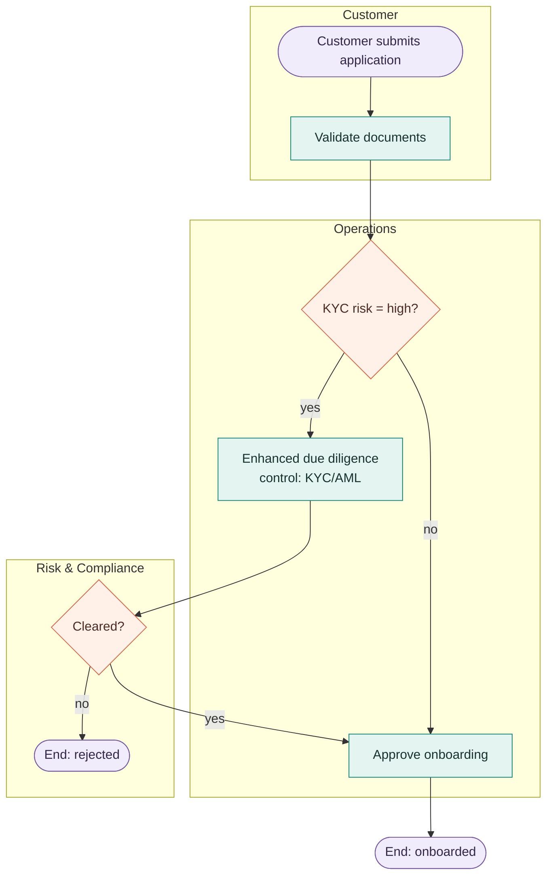

# Process Diagram

Design a disciplined process flow — not a sketch. You are acting as a business analyst: produce a
diagram a process-owner or control function would accept. You write a Mermaid `.mmd` file that renders
natively in the panel (offline).

## 1. Gather the material

Locate the roles, systems of record, triggering events, decision points and their criteria,
controls/approvals, hand-offs, and exception paths.

## 2. Pick a framework and style

Default to **BPMN-style swimlanes** — one lane per role/system, tasks as verb-phrases, gateways for
decisions. If the user named a framework (ITIL, SDLC, three lines of defence, swimlane), follow its
lane conventions.

## 3. Modelling rules (non-negotiable)

- **Exactly one start** (a named trigger) and **at least one explicit end** (happy path, reject,
  exception — none dangling).
- **Every decision is a question with ≥ 2 labelled outgoing edges** ("amount ≥ €100k?" → "yes" /
  "no"). Unlabelled decision edges are a bug.
- **Tasks are verb-phrases** naming an actor's action ("Validate IBAN", "Approve credit limit").
- **One actor per task**, placed in that role's lane. Hand-offs are edges crossing lanes — the most
  valuable thing in the diagram; make them explicit.
- **Controls are first-class.** Model four-eye checks, segregation of duties, and regulatory
  checkpoints as their own steps; note the framework reference (e.g. "SOX 404", "KYC/AML").
- **Compact:** aim for 8–25 nodes; encapsulate big sub-flows rather than expanding everything.
- **Design-first with traceability:** where the source is silent, fill in what a senior analyst
  would draw, and **mark synthesized steps** (prefix the label or add a note with "inferred") so
  the user can review them.
- **Style by function, not lane order:** use a small `classDef` set for action, decision, control, and
  outcome nodes. Keep risk/control colors semantically consistent.

## 4. Write it as Mermaid (.mmd)

Use a `flowchart` with one `subgraph` per lane, and write it to a `.mmd` file — the drawer renders it
natively, **offline**.

Pass the Mermaid source directly to `create_file` as `/process.mmd`; do not write a Python wrapper
for a text artifact. The drawer renders it natively, **offline**.

Use stable node ids. Quote labels containing punctuation; use ` ` only for an intentional visual
line break and `&amp;` only when a literal ampersand must appear in a flowchart label. Prefer plain
words such as "at least" or "under" over angle-bracket comparisons. Decision nodes use `{ }`;
start/end use `([ ])`. The file tool validates `.mmd` syntax; fix any reported parser error before
finishing.

## 5. Deliver

Tell the user the diagram is ready and call out anything you marked as inferred so they can refine
it. To revise, edit the `.mmd`.
